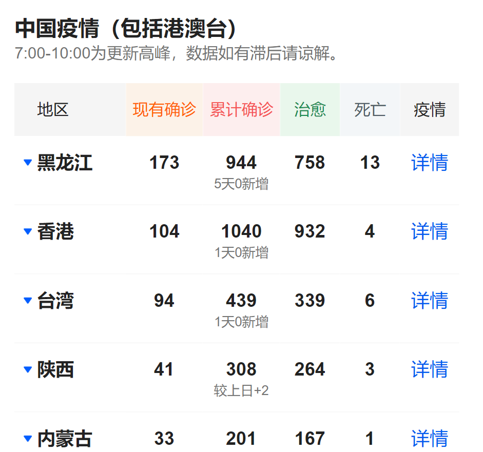
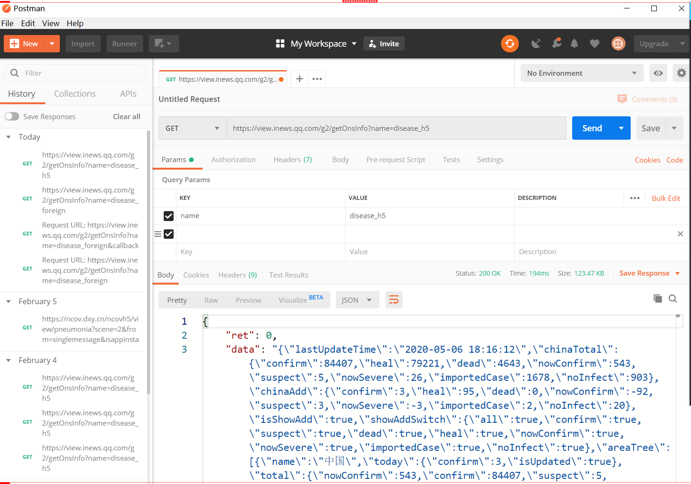

# 实时疫情动态
#### 【数据源】
1、浏览器开发者工具

分析数据源, 本项目主要分析腾讯新闻和丁香医生两个网站的数据

1） 腾讯新闻出品
 https://news.qq.com/zt2020/page/feiyan.htm#/?nojump=1 

工具的打开方式：F12 / Ctrl + Shift + I / 更多工具 - 开发者工具 /  右键 - 检查

选中Network - Preserve log（保存持续的日志）， 重新刷新页面，可以看到网页所有的请求连接和返回数据。

想拿到表格中   国内疫情的数据情况



分析的方式：
通过搜索框，搜索想要获得数据的具体数值，如：944/758等等

分析后的请求地址：

https://view.inews.qq.com/g2/getOnsInfo?name=disease_h5 

返回数据的格式是json(参考`tmp.txt`文件),拿到数据后用json解析工具解析成json树格式(参考`data.json`文件),便于理解

2）丁香医生出品
 https://ncov.dxy.cn/ncovh5/view/pneumonia?scene=2&clicktime=1579579384&enterid=1579579384&from=singlemessage&isappinstalled=0 

分析的方式同上

分析后的请求地址：

https://ncov.dxy.cn/ncovh5/view/pneumonia?scene=2&from=singlemessage&isappinstalled=0

返回数据的格式是html

2、postman（模拟http请求的工具）

验证分析出来的请求地址，在排除上下文环境后，是否依然能够拿到数据。

比如有的请求，依赖cookie、依赖动态的参数等等



#### 【解析数据】

##### (一)  认识JSON

JSON = JavaScript Object Notation   （JavaScript对象表示法）

本质上，是存储和交换文本信息的语法。是一种轻量级的文本数据格式。

java领域内解析json的工具：gson 、 fastjson 、jackson

JSON 和 Java实体类

| JSON        | JAVA实体类                    |
| ----------- | ----------------------------- |
| string      | java.lang.String              |
| number      | java.lang.Number (Double)     |
| true\|false | java.lang.Boolean             |
| null        | null                          |
| array       | java.util.List (ArrayList)    |
| object      | java.util.Map (LinkedTreeMap) |


##### (二) Gson

是google推出的，用来在json数据和java对象之间进行转换的类库。

```
Gson  gson = new Gson();
Gson  gson1 = new GsonBuilder().create();

// 将对象obj转化为json字符串
String jsonStr = gson.toJson(Obj);
// 将json字符串转化为java对象
T obj = gson.fromJson(jsonStr,class)
```

使用方式

1）引入gson依赖

```
<!-- https://mvnrepository.com/artifact/com.google.code.gson/gson -->
        <dependency>
            <groupId>com.google.code.gson</groupId>
            <artifactId>gson</artifactId>
            <version>2.8.6</version>
        </dependency>
```

2）确认要转化的数据格式

```java
import lombok.AllArgsConstructor;
import lombok.Data;

// lombok所带的注解, @Data可以生成getter和setter,@AllArgsConstructor生成全参构造函数
@Data 
@AllArgsConstructor
public class DataBean {

    private String area;
    private int nowConfirm;
    private int confirm;
    private int heal;
    private int dead;
}

```

3）解析文本数据

```java
public class DataHandler {
    public static void main(String[] args) throws Exception{
        getData();
    }

    public static List<DataBean> getData() throws Exception {
        // 读取文件中的文本内容   然后再转化为java对象
        FileReader fr = new FileReader("tmp.txt");
        // 每次读取1024字节放进缓存
        char[] cBuf = new char[1024];
        // 读取到的字符长度
        int cRead = 0;
        StringBuilder builder = new StringBuilder();
        // fr.read(cBuf) 循环读取1024字节后放进cBuf变量,返回读取到的字符长度
        while ((cRead = fr.read(cBuf)) > 0) {
            // new String(cBuf, 0, cRead) 中间的参数0表示从cBuf的第一个字符开始取, cRead表示取的长度
            builder.append(new String(cBuf, 0, cRead));
        }

        fr.close();
        // 通过Gson转化成 Map
        Gson gson = new Gson();
        Map map = gson.fromJson(builder.toString(), Map.class);
        System.out.println(map);
        // 取国内数据
        ArrayList areaList = (ArrayList) map.get("areaTree");
        Map dataMap = (Map) areaList.get(0);
        // 国内数据的子集(即省市数据)
        ArrayList childrenList = (ArrayList) dataMap.get("children");

        // 遍历然后转化
        List<DataBean> result = new ArrayList<>();

        for (int i = 0; i < childrenList.size(); i++) {
            Map tmp = (Map) childrenList.get(i);
            String name = (String)tmp.get("name");
            // total里面包含了现有确诊,累计确诊,治愈,死亡人数等各个数据,取我们需要的这四个数据
            Map totalMap = (Map) tmp.get("total");
            // 数字通过转化后带有小数点,需要拿double来接
            double nowConfirm = (Double)totalMap.get("nowConfirm");
            double confirm = (Double)totalMap.get("confirm");
            double heal = (Double)totalMap.get("heal");
            double dead = (Double)totalMap.get("dead");
            // 存进dataBean
            DataBean dataBean = new DataBean(name,(int)nowConfirm,(int)confirm,
                    (int)heal,(int)dead);

            result.add(dataBean);
        }

        System.out.println(result);

        return result;
    }
}

```
##### (三)  将数据展示在页面中

1、编写service和controller

```java
public interface DataService {

    List<DataBean> list();
}

```

```java
@Service
public class DataServiceImpl implements DataService {

    @Override
    public List<DataBean> list() {
        List<DataBean> result = null;

        try {
            result = DataHandler.getData();
        } catch (Exception e) {
            e.printStackTrace();
        }
        return result;
    }
}

```

```java
@Controller
public class DataController {

    @Autowired
    private DataService dataService;

    @GetMapping("/")
    public String list(Model model){
        List<DataBean> list = dataService.list();
// 在model里加入名为(key,value)=("datalist",list)的数据
        model.addAttribute("dataList",list);
        return "list"; // 返回list.html页面
    }
}

```

2、编写页面（注意已引入thymeleaf的maven依赖）
- 在html标签上加上:`xmlns:th="http://www.thymeleaf.org"`
- 通过${dataList}获取在controller添加的"dataList"值
- `<tr th:each="data:${dataList}">`循环dataList,每次循环的数据放在`data`变量里,一条数据就是表格的一行(tr),每一行的列(td)就通过`data.xx`来获取
- `<td th:text="${data.area}">`将td标签的文本值设为`data.area`对应的值
```html
<!DOCTYPE html>
<html lang="en" xmlns:th="http://www.thymeleaf.org">
<head>
    <meta charset="UTF-8">
    <title>Title</title>
</head>
<body>

<h2>国内疫情情况如下</h2>
<br>

<table>
    <thead>
    <tr>
        <th>地区</th>
        <th>现有确诊</th>
        <th>累计确诊</th>
        <th>治愈</th>
        <th>死亡</th>
    </tr>
    </thead>
    <tbody>
    <tr th:each="data:${dataList}">
        <td th:text="${data.area}">name</td>
        <td th:text="${data.nowConfirm}">nowConfirm</td>
        <td th:text="${data.confirm}">confirm</td>
        <td th:text="${data.heal}">heal</td>
        <td th:text="${data.dead}">dead</td>
    </tr>
    </tbody>
</table>

</body>
</html>
```

##### (四) 转为实时数据

涉及知识点：用java代码模拟http请求

以上方式是从网站上获取到数据后保存到文件里再提取,更方便的方式是直接通过网络连接来实时获取数据

1） HttpURLConnection方式:
- 通过创建url打开远程链接 (HttpURLConnection) 
- 设置相关参数（超时时间和请求头等等）
- 发送请求
- 接收结果（使用InputStream和BufferedReader）

```java
public class HttpURLConnectionUtil {
    public static String doGet(String urlStr) {
        HttpURLConnection conn = null;
        InputStream is = null;
        BufferedReader br = null;
        StringBuilder result = new StringBuilder();

        try {
            URL url = new URL(urlStr);
            // 通过url打开一个远程连接  强转类型
            conn = (HttpURLConnection) url.openConnection();
            conn.setRequestMethod("GET");

            // 连接时间和读取时间
            //  连接时间： 发送请求端 连接到  url目标地址端的时间
            //            受到距离长短和网络速度的影响
            //  读取时间： 指连接成功后  获取数据的时间
            //            受到数据量和服务器处理速度的影响
            conn.setConnectTimeout(15000);
            conn.setReadTimeout(60000);

            // 设定请求头参数的方式：如指定接收json数据   服务端的key值为content-type
            //  conn.setRequestProperty("Accept", "application/json");

            // 发送请求
            conn.connect();

            if (conn.getResponseCode() != 200) {
                // TODO 此处应该增加异常处理
                return "error code";
            }

            is = conn.getInputStream();
            br = new BufferedReader(new InputStreamReader(is, "UTF-8"));
            String line;
            // 逐行读取  不为空就继续
            while ((line = br.readLine()) != null) {
                result.append(line);
                System.out.print(line);
            }
        } catch (Exception e) {
            e.printStackTrace();
        } finally {
            try {
                if (br != null) br.close();
                if (is != null) is.close();

            } catch (Exception e) {
                e.printStackTrace();
            }
        }
        return result.toString();
    }
}  
```

2） HttpClient方式:

添加pom依赖

```
<!-- https://mvnrepository.com/artifact/org.apache.httpcomponents/httpclient -->
<dependency>
    <groupId>org.apache.httpcomponents</groupId>
    <artifactId>httpclient</artifactId>
    <version>4.5.12</version>
</dependency>
```
```
public static String doGet(String urlStr) {

        // 提供了 闭合的httpclient对象
        CloseableHttpClient httpClient = null;
        // 也提供了  闭合的响应对象
        CloseableHttpResponse response = null;

        String result = null;

        try {
            // 使用默认创建方式
            httpClient = HttpClients.createDefault();
            // 创建一个get请求  传入url
            HttpGet httpGet = new HttpGet(urlStr);
            // 设置请求头的方式
            httpGet.addHeader("Accept", "application/json");

            // 设置请求参数  连接时间、数据读取时间(socketTimeOut)等  单位是ms
            //   ConnectionRequestTimeout  指从共享连接池中取出连接的超时时间
            RequestConfig requestConfig = RequestConfig.custom()
                    .setConnectTimeout(35000)
                    .setConnectionRequestTimeout(35000)
                    .setSocketTimeout(60000)
                    .build();

            // 设置配置参数
            httpGet.setConfig(requestConfig);
            // 执行请求
            response = httpClient.execute(httpGet);
            // 从返回对象中获取返回数据
            HttpEntity entity = response.getEntity();

            result = EntityUtils.toString(entity);

        }catch (Exception e){
            e.printStackTrace();
        }

        return result;
    }
```

##### (五) 使用Jsoup解析html格式数据
从丁香医生网站拿到的数据是html格式,数据放在`<script id="getAreaStat">`里,利用Jsoup来解析
1、Jsoup
      是html的解析器，可以解析html文本和直接解析URL地址。
      本质上是通过DOM、CSS以及类似jQuery的方法来取出和操作数据。

```
        Document document = Jsoup.parse(htmlStr);
        System.out.println(document);

        //通过标签名找到元素
        Elements elements = document.getElementsByTag("p");
        System.out.println(elements);
        Element element = document.select("a[href]");  
 
```

2、提供不同数据源的切换查询

1）增加controller方法

```
    // 匹配/list/1,/list/2等, {id}即是1,2...
    // 参数加 @PathVariable 将接收到的地址数据，映射到方法的参数中
    @GetMapping("/list/{id}")
    public String listById(Model model, @PathVariable String id) {
        // service层根据不同id从不同网站上取数据
        List<DataBean> list = dataService.listById(Integer.parseInt(id));
        model.addAttribute("dataList", list);
        return "list";
    }
```
2）完善service
```
    @Override
    public List<DataBean> listById(int id) {
        if (id == 2) {
            return JsoupHandler.getData();
        }
        return list();
    }
```

3） 处理数据的方法
```
public class JsoupHandler {
    public static String urlStr = "https://ncov.dxy.cn/ncovh5/view/pneumonia?" +
            "scene=2&from=singlemessage&isappinstalled=0";

    public static ArrayList<DataBean> getData() {
        ArrayList<DataBean> result = new ArrayList<>();
        try {
            // Jsoup.connect(urlStr).get()获取 html数据
            Document doc = Jsoup.connect(urlStr).get();
            // 找到指定的标签数据
            Element oneScript = doc.getElementById("getAreaStat");
            // 获取到script标签里的数据
            String data = oneScript.data();
            // 字符串截取出json格式的数据
            String subData = data.substring(data.indexOf("["),
                    data.lastIndexOf("]") + 1);

            Gson gson = new Gson();
            ArrayList list = gson.fromJson(subData, ArrayList.class);

            // 再提取需要的数据
            for (int i = 0; i < list.size(); i++) {
                Map map = (Map) list.get(i);
                String name = (String) map.get("provinceName");
                double nowConfirm = (Double) map.get("currentConfirmedCount");
                double confirm = (Double) map.get("confirmedCount");
                double heal = (Double) map.get("curedCount");
                double dead = (Double) map.get("deadCount");

                DataBean dataBean = new DataBean(name, (int) nowConfirm, (int) confirm
                        , (int) heal, (int) dead);
                result.add(dataBean);
            }

        } catch (Exception e) {
            e.printStackTrace();
        }
        return result;
    }
}
```
4） 验证

分别访问 http://localhost:8080/list/1  和  http://localhost:8080/list/2
通过省份的名称来区分不同渠道的数据结果

##### (六) 增加数据存储逻辑

1、引入相关的依赖

```
        <dependency>
            <groupId>org.mybatis.spring.boot</groupId>
            <artifactId>mybatis-spring-boot-starter</artifactId>
            <version>2.1.0</version>
        </dependency>

        <dependency>
            <groupId>mysql</groupId>
            <artifactId>mysql-connector-java</artifactId>
            <scope>runtime</scope>
        </dependency>

        <dependency>
            <groupId>com.baomidou</groupId>
            <artifactId>mybatis-plus-boot-starter</artifactId>
            <version>3.2.0</version>
        </dependency>
```

2、配置数据库

```
spring.datasource.url=jdbc:mysql://localhost:3306/epidemic?serverTimezone=UTC&useUnicode=true&characterEncoding=utf8
spring.datasource.driver-class-name=com.mysql.cj.jdbc.Driver
spring.datasource.username=root
spring.datasource.password=admin
```

3、使用mybatis-plus进行增删改查的操作

1） 创建mapper

```
public interface DataMapper extends BaseMapper<DataBean> {
}
```

2） 扫描mapper的注解
在主程序入口类中添加
```
@MapperScan("cn.wangslip.mapper")
```

3） 创建service及其实现类

注意泛型是要处理的实体类

```
public interface DataService extends IService<DataBean> {

}
```

```
// 泛型 分别是mapper 以及 实体类
@Service
public class DataServiceImpl extends ServiceImpl<DataMapper,DataBean>
        implements DataService {
}
```

4）改造实体类databean

此时要满足，存在无参构造器以及可被序列化
同时指定具体映射的表名   通过@TableName

```
import com.baomidou.mybatisplus.annotation.TableName;
import lombok.AllArgsConstructor;
import lombok.Data;
import lombok.NoArgsConstructor;

import java.io.Serializable;

@Data @AllArgsConstructor
@NoArgsConstructor
@TableName("illness")
public class DataBean implements Serializable {
    private String area;
    private int nowConfirm;
    private int confirm;
    private int heal;
    private int dead;
}

```
4、初始化数据存储的逻辑

@PostConstruct
修饰的方法，在服务器加载Servlet时运行，而且只执行一次

改造逻辑：首先将DataHandler声明为组件 @Component

```
    @Autowired
    private DataService dataService;
   
    @PostConstruct
    public void saveData() {
        try {
            List<DataBean> dataBeans = getData();
            // 先将数据清空  然后存储数据
            dataService.remove(null);
            dataService.saveBatch(dataBeans);

        } catch (Exception e) {
            e.printStackTrace();
        }

    }
```
@Scheduled 定时器

使用前需要在主程序入口类上打开开关

```
@EnableScheduling
```
在方法上使用注解的参数

1） @Scheduled(fixedRate = 10000)   指定频率的执行任务   从方法执行开始就计时
        假设方法执行5s    那么第一次执行开始过了10s后，开始第二次执行

2） @Scheduled(fixedDelay = 10000)   指定间隔的执行任务    从方法执行完成开始计时
        假设方法执行5s    那么第一次执行完成过了10s后，开始第二次执行

3） cron表达式 ——  计划执行的表达式
        把六个位置用空格分隔，指代不同单位的时间，执行的规律
        秒、分钟、小时、日期、月份、星期、(年，可选)

```
    // 配置定时执行的注解  支持cron表达式  
    // 每分钟执行一次  更改可参考cron表达式生成网站
    @Scheduled(cron = "0 0/1 * * * ?")
    public void updateData() {
        System.out.println("更新数据");
        saveData();
    }
```

#### 【展示数据Echarts】

是由百度前端技术部开发，基于js的数据可视化图表库。

https://echarts.apache.org/examples/zh/index.html#chart-type-line


##### （一）折线图(现有确诊)


分析图形展示的数据来源，然后请求数据后转化成我们需要的格式，传递给页面，通过Echarts渲染出来。
1）分析的请求地址

https://view.inews.qq.com/g2/getOnsInfo?name=disease_other

可以获得json格式的数据，数据的key是chinaDayList

2） 使用HttpClient模拟请求
3） 解析出数据

```java
public class GraphHandler {

    public static String urlStr = "https://view.inews.qq.com/g2/getOnsInfo?name=disease_other";

    public static List<GraphBean> getGraphData() {
        List<GraphBean> result = new ArrayList<>();

        String str = HttpClientUtil.doGet(urlStr);

        Gson gson = new Gson();
        Map map = gson.fromJson(str, Map.class);

        String subStr = (String) map.get("data");
        Map subMap = gson.fromJson(subStr, Map.class);

        ArrayList list = (ArrayList) subMap.get("chinaDayList");

        for (int i = 0; i < list.size(); i++) {
            Map tmp = (Map)list.get(i);

            String date = (String)tmp.get("date");
            double nowConfirm = (Double)tmp.get("nowConfirm");
            GraphBean graphBean = new GraphBean(date,(int)nowConfirm);
            result.add(graphBean);
        }
        return result;
    }
}
```
数据结构

```
@Data
@AllArgsConstructor
public class GraphBean {

    private String date;
    private int nowConfirm;
}
```
4）返回给页面渲染

```
    @GetMapping("/graph")
    public String graph(Model model) {
        List<GraphBean> list = GraphHandler.getGraphData();
        //  进一步改造数据格式
        //  因为前端需要的数据是  x轴所有数据的数组和y轴所有数据的数组

        ArrayList<String> dateList = new ArrayList<>();
        ArrayList<Integer> nowConfirmList = new ArrayList<>();

        for (int i = 0; i < list.size(); i++) {
            GraphBean graphBean = list.get(i);
            dateList.add(graphBean.getDate());
            nowConfirmList.add(graphBean.getNowConfirm());
        }

        model.addAttribute("dateList", new Gson().toJson(dateList));
        model.addAttribute("nowConfirmList", new Gson().toJson(nowConfirmList));
        return "graph";
    }
```

```
<!DOCTYPE html>
<html lang="en" xmlns:th="http://www.thymeleaf.org">
<head>
    <meta charset="UTF-8">
    <title>Title</title>
    <script type="text/javascript" src="echarts/echarts.min.js"></script>
</head>
<body>
<!-- 为 ECharts 准备一个具备大小（宽高）的 DOM -->
<div id="main" style="width: 600px;height:400px;"></div>

<!--在js中接收服务端返回数据-->
<script th:inline="javascript">
    // 基于准备好的dom，初始化echarts实例
    var myChart = echarts.init(document.getElementById('main'));

    var dateStr = [[${dateList}]];
    var nowConfirmStr = [[${nowConfirmList}]];

    // 指定图表的配置项和数据
    var option = {
        title: {  // 标题组件
            text: '全国现有确诊趋势'
        },
        tooltip: {  // 提示框组件
            trigger: 'axis'
        },
        legend: {  // 曲线含义说明
            data: ['现有确诊']
        },
        xAxis: {
            // 转化为json对象
            data: JSON.parse(dateStr)
        },
        yAxis: {
            type: 'value'
        },
        series: [{
            name: '现有确诊',
            data: JSON.parse(nowConfirmStr),
            type: 'line'
        }]
    };

    // 使用刚指定的配置项和数据显示图表。
    myChart.setOption(option);
</script>

</body>
</html>
```

Echars教程地址： [教程地址](https://echarts.apache.org/zh/tutorial.html#5 分钟上手 ECharts)

准备dom ->  通过js渲染数据 ->  使用[[${ sth }]] 接收服务端数据  
->  使用JSON.parse()解析json字符串  ->  获得渲染结果

##### （二）折线图2(新增趋势)


相关逻辑在 GraphAddBean对应的代码中

处理数据 ->  转化格式 ->  返回数据给echarts渲染

GraphHandler     DataController     *.html

1）GraphHandler

```
public static List<GraphAddBean> getGraphAddData(String str) {

        List<GraphAddBean> result = new ArrayList<>();

        Gson gson = new Gson();
        Map map = gson.fromJson(str, Map.class);

        String subStr = (String) map.get("data");
        Map subMap = gson.fromJson(subStr, Map.class);

        ArrayList list = (ArrayList) subMap.get("chinaDayAddList");

        for (int i = 0; i < list.size(); i++) {
            Map tmp = (Map) list.get(i);
            String date = (String) tmp.get("date");
            double addConfirm = (Double) tmp.get("confirm");
            double addSuspect = (Double) tmp.get("suspect");

            GraphAddBean graphAddBean = new GraphAddBean(date,
                    (int) addConfirm, (int) addSuspect);
            result.add(graphAddBean);
        }

        return result;
    }

```

2）DataController

```
 @GetMapping("/graphAdd")
    public String graphAdd(Model model) {
        List<GraphAddBean> list = GraphHandler.getGraphAddData();

        ArrayList<String> dateList = new ArrayList<>();
        ArrayList<Integer> addConfirmList = new ArrayList<>();
        ArrayList<Integer> addSuspectList = new ArrayList<>();

        for (int i = 0; i < list.size(); i++) {
            GraphAddBean graphAddBean = list.get(i);
            dateList.add(graphAddBean.getDate());
            addConfirmList.add(graphAddBean.getAddConfirm());
            addSuspectList.add(graphAddBean.getAddSuspect());
        }

        model.addAttribute("dateList", new Gson().toJson(dateList));
        model.addAttribute("addConfirmList", new Gson().toJson(addConfirmList));
        model.addAttribute("addSuspectList", new Gson().toJson(addSuspectList));
        return "graphAdd";
    }
```

3）HTML

增加折线时，主要在legend和series中增加对应元素

```
<!DOCTYPE html>
<html lang="en" xmlns:th="http://www.thymeleaf.org">
<head>
    <meta charset="UTF-8">
    <title>Title</title>
    <script type="text/javascript" src="echarts/echarts.min.js"></script>
</head>
<body>


<!-- 为 ECharts 准备一个具备大小（宽高）的 DOM -->
<div id="main" style="width: 600px;height:400px;"></div>

<!--在js中接收服务端返回数据-->
<script th:inline="javascript">
    // 基于准备好的dom，初始化echarts实例
    var myChart = echarts.init(document.getElementById('main'));

    var dateStr = [[${dateList}]];
    var addConfirmStr = [[${addConfirmList}]];
    var addSuspectStr = [[${addSuspectList}]];

    // 指定图表的配置项和数据
    var option = {
        title: {  // 标题组件
            text: '全国疫情新增趋势'
        },
        tooltip: {  // 提示框组件
            trigger: 'axis'
        },
        legend: {  // 曲线含义说明
            data: ['新增确诊', '新增疑似']
        },
        xAxis: {
            // 转化为json对象
            data: JSON.parse(dateStr)
        },
        yAxis: {
            type: 'value'
        },
        series: [{
            name: '新增确诊',
            data: JSON.parse(addConfirmStr),
            type: 'line'
        }, {
            name: '新增疑似',
            data: JSON.parse(addSuspectStr),
            type: 'line'
        }]
    };

    // 使用刚指定的配置项和数据显示图表。
    myChart.setOption(option);
</script>

</body>
</html>
```
##### （三）柱状图


先分析数据的来源 ->   经过对数据的处理和计算  ->  发送给前端组件进行渲染

对应在GraphColumnarBean相关的逻辑中

特别之处在于  拿到数据之后需要排序,GraphColumnarBean实现 `Comparable` 接口的`compareTo`方法

按fromAbroad降序排
```
@Data
@AllArgsConstructor
public class GraphColumnarBean implements Comparable<GraphColumnarBean> {

    private String area;
    private int fromAbroad;

    @Override
    public int compareTo(GraphColumnarBean o) {
        return o.getFromAbroad() - this.getFromAbroad();
    }
}
```
排序之后将前十的数据返回

```
    @GetMapping("/graphColumnar")
    public String graphColumnar(Model model) {
        List<GraphColumnarBean> list = GraphHandler.getGraphColumnarData();
        Collections.sort(list);

        ArrayList<String> nameList = new ArrayList<>();
        ArrayList<Integer> fromAbroadList = new ArrayList<>();

        for (int i = 0; i < 10; i++) {
            GraphColumnarBean bean = list.get(i);
            nameList.add(bean.getArea());
            fromAbroadList.add(bean.getFromAbroad());
        }

        model.addAttribute("nameList", new Gson().toJson(nameList));
        model.addAttribute("fromAbroadList", new Gson().toJson(fromAbroadList));
        return "graphColumnar";
    }

```

柱状图的数据示例

```
// 指定图表的配置项和数据
    var option = {
        title: {  // 标题组件
            text: '境外输入省市TOP10'
        },
        tooltip: {  // 提示框组件
            trigger: 'axis'
        },
        xAxis: {
            // 转化为json对象
            data: JSON.parse(nameStr)
        },
        yAxis: {
            type: 'value'
        },
        series: [
            {
                name: '境外输入',
                type: 'bar',
                barWidth: '60%',
                data: JSON.parse(fromAbroadStr)
            }
        ]
    };
```
##### （四）饼状图


对应在GraphPieBean相关的逻辑中

graphPie.html

```

    // 指定图表的配置项和数据
    var option = {
        title: {  // 标题组件
            text: '全国现有确诊构成'
        },
        tooltip: {  // 提示框组件
            trigger: 'axis'
        },
        series: [
            {
                type: 'pie',
                radius: '55%',
                center: ['50%', '60%'],
                data: JSON.parse(str)
            }
        ]
    };
```
##### (五)  中国地图
使用`echarts-en.min.js`包,不然地图设置不了多种颜色


引入新的js 【china.js】
数据来源已存储到表格中

map.html

```
<!DOCTYPE html>
<html lang="en" xmlns:th="http://www.thymeleaf.org">
<head>
    <meta charset="UTF-8">
    <title>Title</title>

    <script type="text/javascript" src="echarts/echarts.min.js"></script>
    <script type="text/javascript" src="echarts/china.js"></script>
</head>
<body>

<!--教程相关文章 https://www.w3cschool.cn/echarts_tutorial/echarts_tutorial-7pbk2gm8.html-->

<div id="main" style="width: 1000px;height:700px;"></div>
<script th:inline="javascript">
    var dataStr = [[${mapData}]];

        let mapOption = {
            title: {
                text: '疫情地图',
                subtext: '仅供参考',
                x: 'center'
            },
            backgroundColor: '#FFFFFF',
            tooltip: {
                formatter: function (params, ticket, callback) {
                    let retStr=`${params.seriesName}<br/>${params.name}：${params.value}`;
                    retStr = `${retStr}<br/><span>分享</span> | <span onclick="showDetail('${params.name}')" class="detail-btn">详情 &gt;</span>`
                    return retStr
                },
                triggerOn: 'click',
                enterable: true
            },
            visualMap: {
                show: true,
                x: 'left',
                y: 'bottom',
                splitList: [
                    {start: 10000,label:'10000 人及以上'},
                    {start: 1000, end: 9999,label: '1000 - 9999 人'},
                    {start: 500, end: 999,label: '500 - 999 人'},
                    {start: 100, end: 499,label: '100 - 499 人'},
                    {start: 10, end: 99,label: '10 - 99 人'},
                    {start: 1, end: 9,label: '1 - 9 人'},
                    {start: 0, end: 0,label: '0 人'},
                ],
                color: ['#ff2736', '#ff6341', '#ffa577', '#ffcea0', '#ffe7b2', '#e2ebf4',]
            },

            series: [{
                name: '累计确诊',
                type: 'map',
                mapType: 'china',
                roam: true,
                label: {
                    normal: {
                        show: true
                    },
                    emphasis: {
                        show: false
                    }
                },
                data: JSON.parse(dataStr),
            }]
        };
        var mapChart = echarts.init(document.getElementById("graph4"))
        mapChart.setOption(mapOption);

</script>

</body>
</html>
```
#### 【国际化】

是对thymeleaf中消息表达式的一种应用， #{} , 提供的是对配置文件中信息的读取。

##### （一） 使用浏览器识别语种

1） 在resources目录下，创建i18n文件夹，再继续创建 *.properties文件。

设置其中的key和value  （注意：此时的编码格式需要在idea的设置中确认,
按住ctrl+alt+S,搜索encoding,全部选utf-8,勾选Transparen native-to-ascii conversation）


```
list.title=疫情最新动态-D
list.h2=国内疫情情况如下-D
list.table.name1=地区-D
list.table.name2=现有确诊-D
list.table.name3=累计确诊-D
list.table.name4=治愈-D
list.table.name5=死亡-D
```
2） 创建其他语种对应的配置文件，如 \*_en_US.properties 和  \*_zh_CN.properties

3）在html中更改对key值的引用方式，使用消息表达式

```
<title th:text="#{list.title}">疫情最新动态</title>

<div class="page-header"><h2 th:text="#{list.h2}">国内疫情情况如下</h2></div>

....
```
4）让spring找到国际化文件对应的位置，在application.properties中

 ```
spring.messages.basename=i18n.list
 ```
5） 验证方式
通过更改浏览器中  【设置】 - 【高级】 - 【语言】 - 【找到英语（美国）】，可以通过置顶，切换中英文显示。


本质原因是，因为请求的请求头中，会设置不同的Accept-Language的值。


##### （二）自定义切换语种

使用spring提供的国际化使用类  LocaleResolver

1） 页面中增加按钮

```
    <label>
        <a class="btn btn-sm" th:href="@{/(lan='zh_CN')}">中文</a>
        <a class="btn btn-sm" th:href="@{/(lan='en_US')}">英文</a>
    </label>
```

2） 自定义LocaleResolver类的实现

```java
public class MyLocaleResolver implements LocaleResolver {
    @Override
    public Locale resolveLocale(HttpServletRequest httpServletRequest) {
        String lan = httpServletRequest.getParameter("lan");
        Locale locale = Locale.getDefault();
        if (!StringUtils.isEmpty(lan)) {
            String[] split = lan.split("_");
            locale = new Locale(split[0], split[1]);
        }
        return locale;
    }

    @Override
    public void setLocale(HttpServletRequest httpServletRequest, HttpServletResponse httpServletResponse, Locale locale) {

    }
}
```

3） 注入spring

```java
@Configuration
public class MyConfig {

    @Bean
    public LocaleResolver localeResolver() {
        return new MyLocaleResolver();
    }
}
```

4） 验证   此时切换按钮时，可以看到不同语种的显示
#### 【订阅数据】

##### （一）邮件

java提供的原生的工具，设定的邮件发送和接收流程


【协议】
SMTP =  Simple Mail Transfer Protocol  简单邮件传输协议
在邮件发送时主要会使用到的协议，服务器地址形如：smtp.***.com

如果从qq邮箱，发送邮件到126邮箱， 使用的前提是，确认qq邮箱中 【设置】 -【账户】 - 【SMTP服务】是开启的状态 -【获取授权码】

```
        <dependency>
            <groupId>javax.mail</groupId>
            <artifactId>mail</artifactId>
            <version>1.4.7</version>
        </dependency>
```

```
 // 从qq邮箱  发送邮件  到sina邮箱
    public static void send() throws Exception{
        // 1) 通过配置构成邮件的会话
        Properties prop = new Properties();
        // 配置协议和服务器地址
        prop.setProperty("mail.transport.protocol","smtp");
        prop.setProperty("mail.smtp.host","smtp.qq.com");
        prop.setProperty("mail.smtp.auth","true");

        String port = "465";
        prop.setProperty("mail.smtp.port",port);
        prop.setProperty("mail.smtp.socketFactory.class","javax.net.ssl.SSLSocketFactory");
        prop.setProperty("mail.smtp.socketFactory.fallback","false");
        prop.setProperty("mail.smtp.socketFactory.port",port);

        // 2) 创建会话
        Session session = Session.getInstance(prop);

        // 3) 创建一封邮件
        MimeMessage message = new MimeMessage(session);
        String sendMail = "34927298@qq.com";
        String Recipients = "wangslip@sina.com";
        message.setFrom(new InternetAddress(sendMail,"wang","UTF-8"));
        // MimeMessage.RecipientType.CC 抄送  MimeMessage.RecipientType.BCC 密送
        message.setRecipient(MimeMessage.RecipientType.TO ,
                new InternetAddress(Recipients,"wangslip","UTF-8"));

        // 标题 正文  发件时间
        message.setSubject("来自wang的问候","UTF-8");
        message.setContent("不要给我发邮件哦","text/html;charset=UTF-8");
        message.setSentDate(new Date());

        // 可以保存为 *.eml的文件格式
        message.saveChanges();


        // 4) 获取邮件传输对象  建立连接 并发送
        Transport transport = session.getTransport();
        String accout = "34927298@qq.com";
        String password = "*************";
        transport.connect(accout,password);
        transport.sendMessage(message,message.getAllRecipients());

        transport.close();
    }
```

【springboot中整合】

1） 引入依赖

```
        <dependency>
            <groupId>org.springframework.boot</groupId>
            <artifactId>spring-boot-starter-mail</artifactId>
        </dependency>
```

2） 参数配置 application.properties

```
spring.mail.username=34927298@qq.com
spring.mail.password=*********
spring.mail.host=smtp.qq.com
spring.mail.properties.mail.smtp.ssl.enable=true
```

3） 编写逻辑

```
@Component
public class MailHandler {

    @Autowired
    private JavaMailSender mailSender;

    public void send() {
        System.out.println("执行邮件发送逻辑");
        SimpleMailMessage mailMessage = new SimpleMailMessage();

        mailMessage.setSubject("来自wang的问候");
        mailMessage.setText("你好!欢迎光临");

        mailMessage.setTo("wangslip@sina.cn");
        mailMessage.setFrom("34927298@qq.com");

        mailSender.send(mailMessage);
    }
}
```

4） 改造成模板引擎渲染的html效果

注意： 要更改为自己的邮箱和密码

#### （二）异步任务

如果部署多台服务器，如何保障邮件只发送一次？

消息中间件 ，可以做到发送一条消息让所有服务器都接收，也可以做到发送一条消息，只交给某一台服务器接收（重要特性）。

为了符合消息中间件的等待时间，需要先返回消息处理的结果，再进行具体的逻辑，此时使用异步任务。

使用方式：

1） 先在主程序入口类上，打开相应的开关 @EnableAsync
2） 在需要异步执行的方法上添加注解  @Async

#### 【认证和授权】

##### （一） 登录

1） 登录页面编写  login.html
2） 登录的校验逻辑

```
@Controller
public class LoginController {

    // 此时接收的是 localhost:8080/login的get请求地址  跳转到登录页面中
    @GetMapping("/login")
    public String login(){
        return "login";
    }

    // 接收的是  登录表单中的post请求及其参数  登录后跳转到首页
    @PostMapping("/login")
    public String login(@RequestParam("username")String username,
                        @RequestParam("password")String password,
                        Map<String,Object> map, HttpSession session){
        // 只要用户名不为空  且密码符合要求
        if(!StringUtils.isEmpty(username) && "123456".equals(password)){
            // 用session存储登录状态
            session.setAttribute("loginUser",username);
            // 登录成功  跳转首页
            return "redirect:/";
        }

        return "login";
    }
}

```

3） 增加拦截器

```
@Component
public class MyInterceptor implements HandlerInterceptor {

    @Override
    public boolean preHandle(HttpServletRequest request,
                             HttpServletResponse response,
                             Object handler) throws Exception {
        System.out.println("----MyInterceptor---preHandle---");

        Object user = request.getSession().getAttribute("loginUser");
        // 已登录  放行
        if (user != null) return true;

        request.getRequestDispatcher("/login").forward(request, response);
        return false;
    }
}
```

4） 注册到springmvc中

```
@Configuration
public class MyWebMvcConfig implements WebMvcConfigurer {

    @Autowired
    private MyInterceptor interceptor;

    // 注册自定义拦截器，声明相关拦截规则
    @Override
    public void addInterceptors(InterceptorRegistry registry) {

        registry.addInterceptor(interceptor).addPathPatterns("/**")
                .excludePathPatterns("/login", "/*.css", "/*.js");

    }
}
```
##### （二） cookie和session

因为web程序所使用的http协议，是无状态的，所以二者的出现是用来解决会话跟踪问题的。

二者区别

1）一个存储在客户端浏览器中，一个存储在服务器中。
2）cookie不够安全，可以被伪造对服务器进行欺骗
3）当访问量增多时，session的存储可能带来服务器压力，要考虑减轻
4）cookie的使用有大小和长度的限制，如大小是在4k左右。

分布式session

对应于单体应用（一台服务器），如果使用了分布式部署（多台服务器），如何保障用户登录后，如果分发到其他服务器，仍旧能找到登录信息，或者不会再分发到第二台服务器上？

1） 情况一


方案1：session复制

任何服务器的session发生变化，就将信息进行序列化，然后广播传输给其他服务器，来保证session同步。

方案2：session缓存 （最常用）

将session存储到redis等分布式缓存中，统一所有服务器去存储和读取的位置。

2） 情况二


方案3： 粘性session

在nginx中配置，通过对ip地址求hash，使得同一ip地址的请求都分发到固定的服务器中。

##### （三） spring-security

解决的问题是，认证和授权。 类似的框架有Shiro。

认证，是问你是谁？
授权，是告诉你，你可以做哪些事儿。

用户和权限的通用模型：


可以对应出五张表，来描述用户及角色，和角色所拥有的权限。

使用流程：

1）引入依赖

```
        <dependency>
            <groupId>org.springframework.boot</groupId>
            <artifactId>spring-boot-starter-security</artifactId>
        </dependency>
```

2） 创建页面   welcome   + level1/1.html等等

3） 编写控制逻辑   

```
@Controller
public class WelcomeController {

    @GetMapping("/welcome")
    public String welcome() {
        return "welcome";
    }

    @GetMapping("/manage/{path}")
    public String level1(@PathVariable("path") String path) {
        return "manage/" + path;
    }

    @GetMapping("/admin/{path}")
    public String level2(@PathVariable("path") String path) {
        return "admin/" + path;
    }

    @GetMapping("/vip/{path}")
    public String level3(@PathVariable("path") String path) {
        return "vip/" + path;
    }
}
```

4） 去掉自己声明的拦截器以及对login的post请求的处理

5） 配置用户、角色及权限的方式

```
@EnableWebSecurity
public class MySecurityConfig extends WebSecurityConfigurerAdapter {

    @Override
    protected void configure(HttpSecurity http) throws Exception {

        // 设定角色的权限  (角色和资源的对应关系)
        http.authorizeRequests().antMatchers("/").permitAll()
                .antMatchers("/vip/**").hasRole("VIP0")
                .antMatchers("/admin/**").hasRole("VIP1")
                .antMatchers("/manage/**").hasRole("VIP2");

        // 开启自动配置的登录功能
        http.formLogin().usernameParameter("username").passwordParameter("password")
                .loginPage("/login");
//        super.configure(http);
    }

    @Override
    protected void configure(AuthenticationManagerBuilder auth) throws Exception {

        // 设定 用户 密码 及角色的关联关系
        // security要求用户登录时  密码必须加密
        String pwd = new BCryptPasswordEncoder().encode("123456");
        auth.inMemoryAuthentication().passwordEncoder(new BCryptPasswordEncoder())
                .withUser("root").password(pwd).roles("VIP0","VIP1","VIP2")
                .and()
                .withUser("admin").password(pwd).roles("VIP0","VIP1")
                .and()
                .withUser("guest").password(pwd).roles("VIP0");

//        super.configure(auth);
    }
}

```
