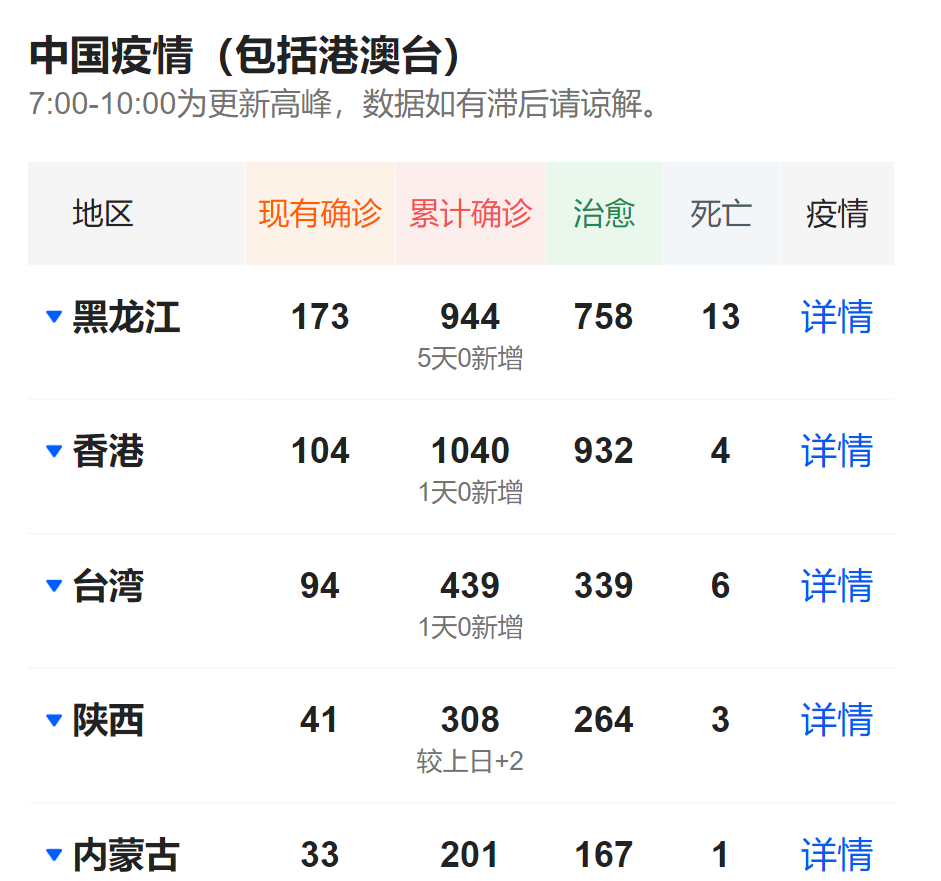
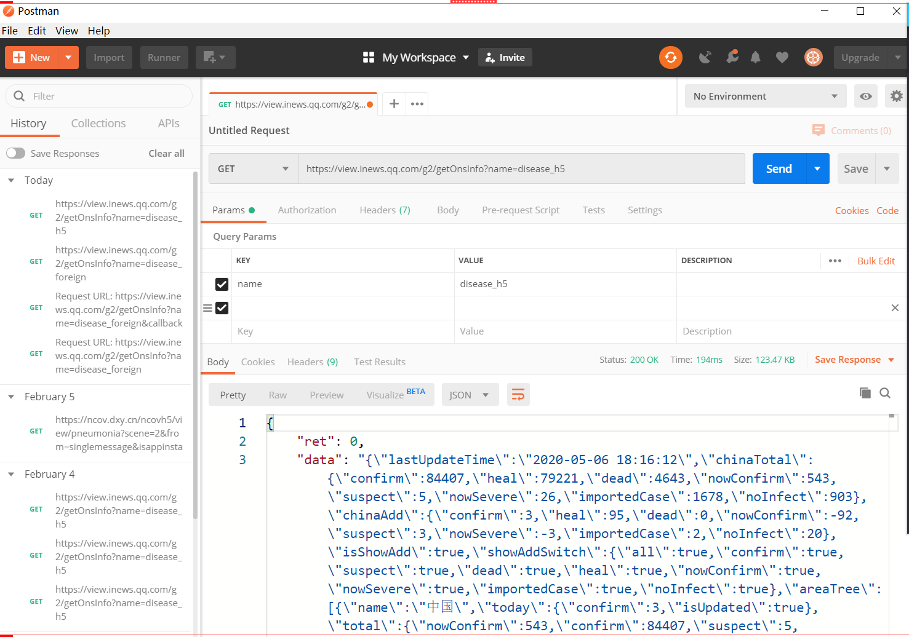
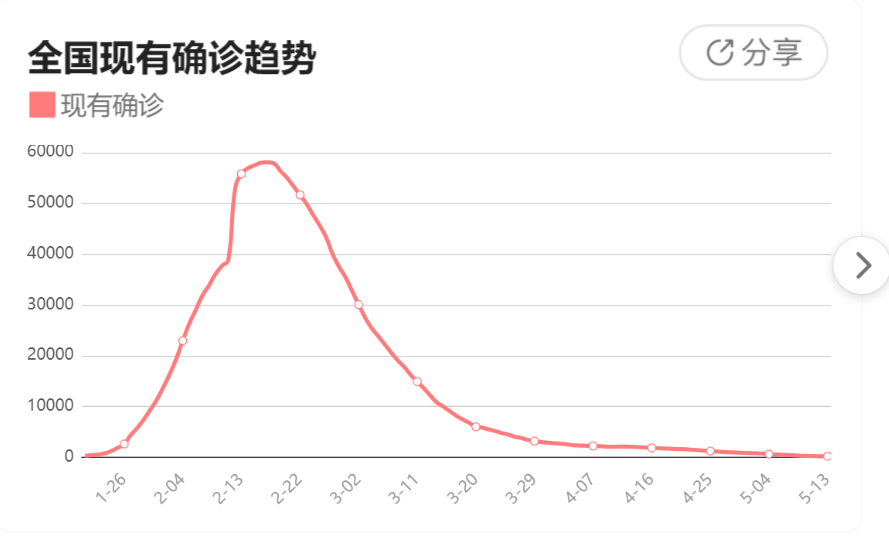
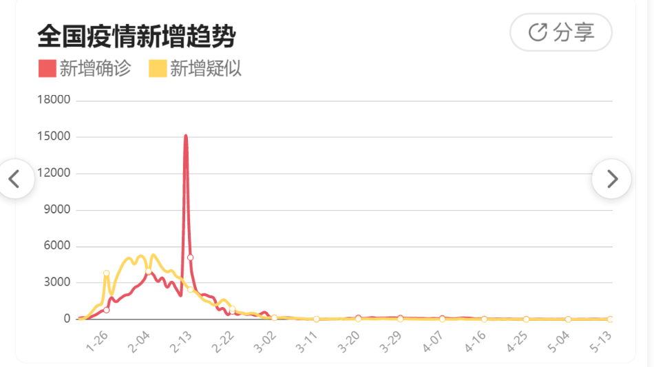
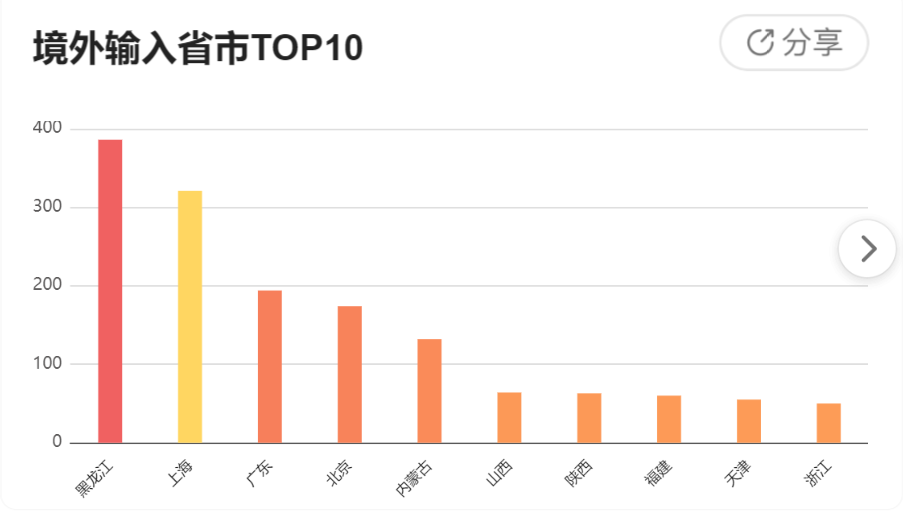
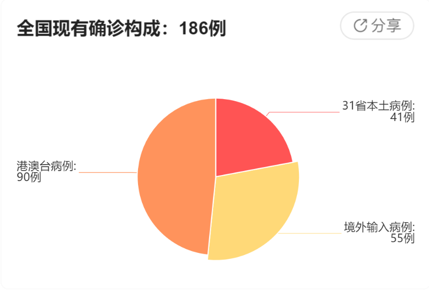
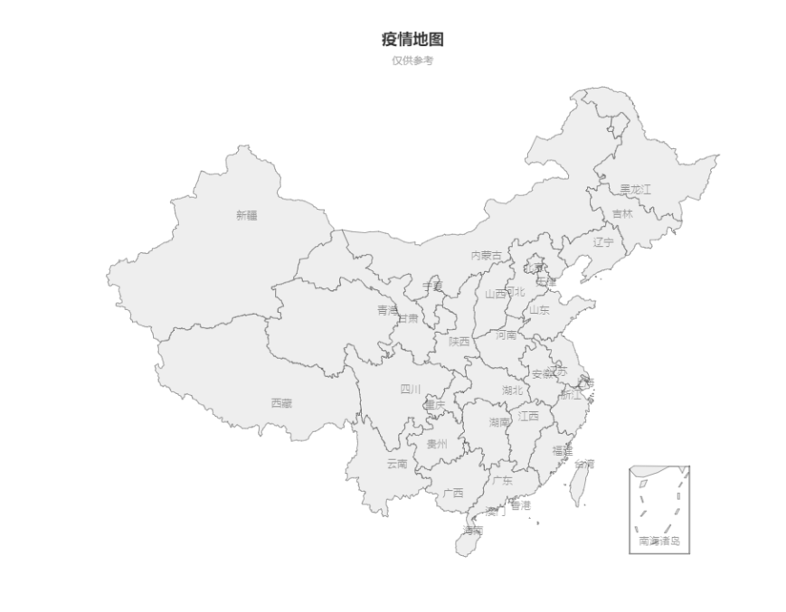

# 实时疫情动态
详细说明参见detail.md
#### 【数据源】
 本项目主要分析腾讯新闻和丁香医生两个网站的数据
1. 浏览器分析数据源

1）腾讯新闻

 https://news.qq.com/zt2020/page/feiyan.htm#/?nojump=1 

国内疫情的数据情况



分析后的请求地址：

https://view.inews.qq.com/g2/getOnsInfo?name=disease_h5 

返回数据的格式是json(参考`tmp.txt`文件)

2）丁香医生

 https://ncov.dxy.cn/ncovh5/view/pneumonia?scene=2&clicktime=1579579384&enterid=1579579384&from=singlemessage&isappinstalled=0 

分析后的请求地址：

https://ncov.dxy.cn/ncovh5/view/pneumonia?scene=2&from=singlemessage&isappinstalled=0

返回数据的格式是html

2、postman（模拟http请求的工具）

验证分析出来的请求地址，在排除上下文环境后，是否依然能够拿到数据。



#### 【解析数据】

##### (一) JSON, html数据提取(Gson, Jsoup)

##### (二) 将数据展示在页面中

##### (三) 转为实时数据 (HttpURLConnection, HttpClient请求获取数据)

##### (四) 数据缓存, 持久化 (数据库保存数据)

##### (五) 提供不同数据源的切换查询

##### (六) 定时任务

#### 【展示数据Echarts】

##### （一）折线图(现有确诊)



##### （二）折线图2(新增趋势)



##### （三）柱状图



用到数据Bean排序

```
@Data
@AllArgsConstructor
public class GraphColumnarBean implements Comparable<GraphColumnarBean> {
    private String area;
    private int fromAbroad;

    @Override
    public int compareTo(GraphColumnarBean o) {
        return o.getFromAbroad() - this.getFromAbroad();
    }
}
```
##### （四）饼状图



##### (五)  中国地图



#### 【国际化】

##### （一） 使用浏览器识别语种

##### （二）自定义切换语种

#### 【订阅数据】

##### （一）邮件

##### （二）异步任务

#### 【认证和授权】

#####  spring-security

地址|访问限制(哪些角色的用户可以访问)
---|---
/manage/1|VIP2
/admin/1|VIP1,VIP2
/vip/1|VIP0,VIP1,VIP2
/|无限制

用户名|权限|
---|---
root|VIP0,VIP1,VIP2|/manage/1
admin|VIP0,VIP1|
guest|VIP0|

以上用户密码都是123456